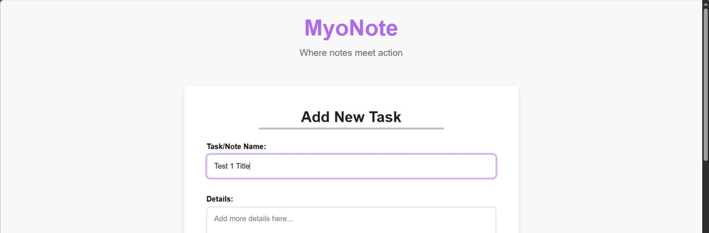
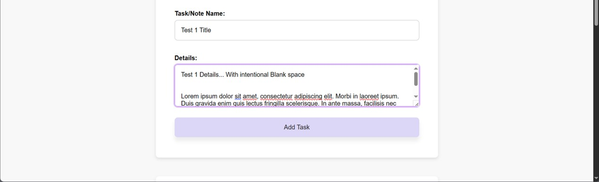
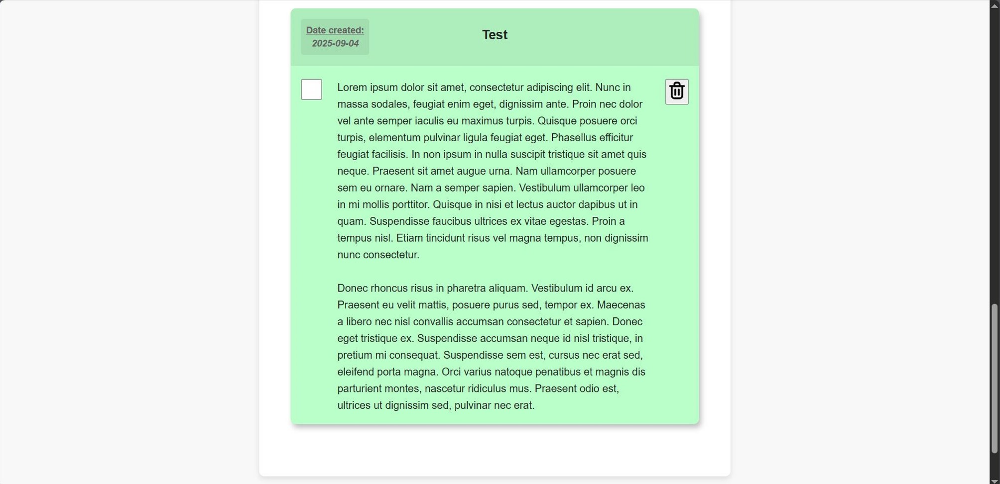
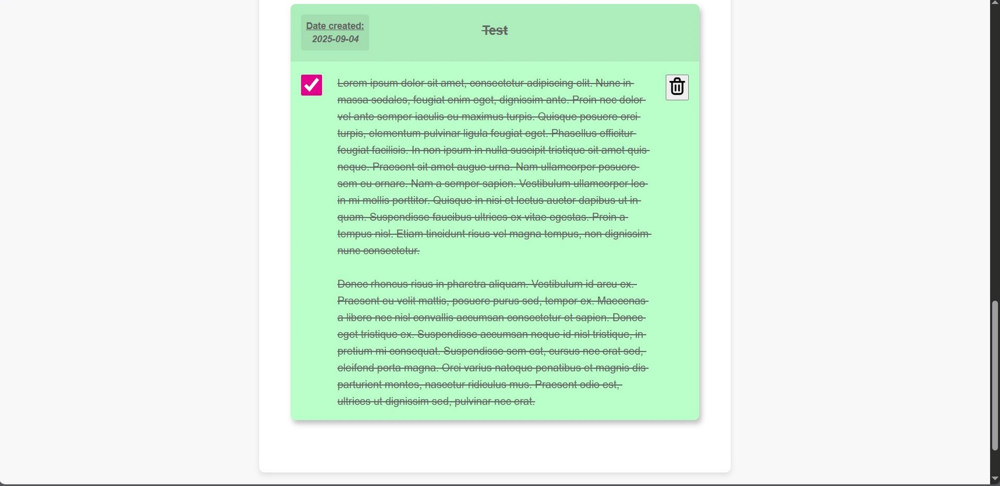
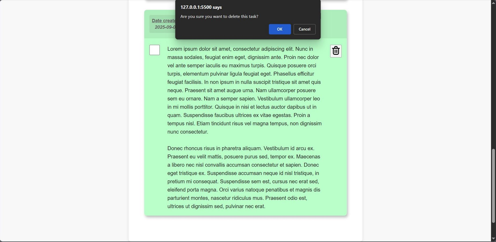

 

# "MyoNote -  To Do List Web App"   - Misael's 3rd F. End Learning Project 

Hello... 😃👋🏻  
It's me Misael (_ElMyosotisCode_) your future Front End Developer Expert.

This project is my third learning project in the field of Front End Dev. As stated in the title, this project is a simple web application that contains a To-Do List tool.

 

---

 

## 🗺️ Roadmap

So here are my plans for this learning project...  
⚠️ _May change in the future !_

### 🎯 **_Phase 1 : The Base of Interactive Prototype_**

> Create a fully interactive application on the client side. Users can add, manage, and delete tasks. At the end of this phase, I will have a product that “looks” and “feels” complete, even though the data is not yet persistent.

 

* ☑ **`HTML`** | <u> A basic structural sketch for the To-Do List Web-App. </u>

    * _Building the core structure with semantic tags to ensure accessibility and a solid foundation_

 

* ☑ **`CSS`** | <u> A clean, centered layout for the main Web-App. </u>

    * _Applying the "Centered Container" pattern using `max-width` and `margin: auto` for cleaner visuals._

* ☑ **`CSS`** | <u> Modern styling for all interactive elements. </u>

    * _Giving styles for inputs, buttons, and task items so it will be visually clear and consistent._

* ☑ **`CSS`** | <u> Visual feedback for user actions and task states. </u>
    
    *  _Creating a `.completed` state class that acts as a bridge between `CSS` and `JavaScript` to reflect task status._

* ☑ **`CSS`** | <u> Modern styling for all interactive elements. </u>

    * _Adding `transition` with `:hover` and `:focus` styling so it looks more lively._

* ☑ **`CSS`** | <u> Change the layout of the task items to be more appealing. </u>

    * _Refactoring the item layout using `grid-template-areas` for better visual hierarchy._

 

* ☑ **`JS`** | <u> Using a structured data list as the Web-App's brain. </u>

    * _Defining an `Array of Objects` as the single source of truth for all task data._

* ☑ **`JS`** | <u> Displaying the task list on the screen automatically. </u>

    * _Implementing a `render()` function that dynamically generates `HTML` from the data array and injects it into the `DOM` ._

* ☑ **`JS`** | <u> Making the "Add Task" button actually work. </u>

    * _Capturing user input via a `submit` event listener and updating the data array with the new task._

* ☑ **`JS`** | <u> Allowing users to mark tasks as completed. </u>

    * _Using event delegation and the `.map()` method to toggle the `completed` status of a task in the data array._

* ☑ **`JS`** | <u> Allowing users to remove tasks from their list. </u>

    * _Using event delegation and the `.filter()` method to remove a task from the data array._

* ☑ **`JS`** | <u> Adding a confirmation step for delete actions. </u>
    * _Implementing a `window.confirm()` dialog before deleting a task to prevent accidental data loss, improving user experience._

 

- - - - -

 

### 🎯 **_Phase 2 : Web-App Memory_**
_*** TBA_

 

- - - - -

 

### 🎯 **_Phase 3 : Web-App Polishing_**
_*** TBA_

 

---

 

## 🛠️ Development Log / Project Journal

### Project Progress Session 01 - Project Setup & JavaScript First Contact
📅 _**Date:** 2025, Aug. 26th_

 

💬 In this initial session of MyoNote project, the primary focus was on establishing a professional project workflow and building the foundational structure. Today, I laid the complete groundwork for the application and made the first successful connection into the JavaScript.

 

*  📍 **Semantic `HTML` Structure**
    
    * Created the core index.html file, complete with a semantic layout ( `<header>`, `<main>` ), a `<form>` for task input, and an empty `<ul>` to serve as the task list container.

 

* 📍 **`CSS` Base Architecture and Variables Implementation**

    * Added a personal customized `CSS` architecture inside `styling.css` file, did `CSS` minimal resets, and added a set of basic variables that will be used for styling purposes later on.

 

* 📍 **`JavaScript` Integration & Verification**

    * Successfully linked the `script.js` file to the HTML and confirmed the connection via the browser's developer console, marking the app's first "pulse" of interactivity.

 

### Web-App Visual in Progress Session 01 📸

  

- - - - -

  

### Project Progress Session 02 - Bringing Data to Life
📅 _**Date:** 2025, Aug. 27th_

 

💭 Today, **MyoNote** made a huge leap from just a design sketch into a living, breathing application. The main goal was to teach the app how to read a list of tasks from its "brain" (my `JavaScript` code) and display them beautifully on the screen. Now, what you see is a direct reflection of the data inside, eventhough the data is still dummy.

 

* 📌 **New Feature: Your Task List is Now Visible!**
    
    * The app can now process a predefined list of tasks and automatically build the task list you see on the page. Each task is created as its own item, complete with a title and detailed notes.

 

* 📌 **New Feature: "Completed" Tasks Now Look Different!**

    * I've built a "bridge" between our data and the visual design. Now, if a task is marked as 'completed' in the data, it will automatically appear crossed-out on the screen, giving you clear visual feedback on your progress.

 

* 📌 **UI/UX Upgrade: From Plain List to Colorful Cards!**

    * The boring, default list has been transformed into a much more organized and visually appealing card-based design. Each task now sits in its own "card".

    * To make things more lively, each card now has a soft, colorful background, with colors alternating automatically to make the list easier to scan and more pleasant to look at.

    * The "Add New Task" form has also been cleaned up, with labels and input fields now neatly organized for a better user experience.

 

### Web-App Visual in Progress Session 02 📸

 

  

- - - - -

  

### Project Progress Session 03 - The App Comes to Life!
📅 _**Date:** 2025, Sept. 2nd_

 

💬 This is the update where **MyoNote** learns to listen to user's input. Today, I've added interactivity, transforming the app from a static display into a dynamic workspace. The core focus was to make the "_Add Task_" feature fully functional, creating a seamless loop from user thought to digital note. What was once just a button is now a gateway to productivity, although it still cannot be completely saved in the browser yet.

 

* 📍 **Major Feature: The "Add Task" Form is Now Fully Operational!**

    * The application now actively listens for when you hit the "_Add Task_" button or press Enter.

    * Your new notes (complete with a title and details) are now instantly captured and added to your task list in real-time. No page reload required!

    * I've also added a smart validation layer; the app will now politely ask you to fill in the fields if you try to submit an empty note, ensuring your list stays clean and meaningful.

 

* 📍 **UI/UX Upgrade: A More Responsive & Satisfying Interface!**

    * **Interactive Feedback:**   
    The input fields and the "_Add Task_" button now provide clear visual feedback. Input fields will "_glow_" when you're typing, and the button will subtly lift and change, making interactions feel more tangible and responsive.

    * **Smoother Animations:**   
    All visual changes, from the input glow to the button hover, are now powered by `CSS` transition. This removes any jarring, instant changes and replaces them with fluid, professional animations.

    * **Smarter Text Formatting:**  
    Intentional line breaks and spacing in your detailed notes are preserved, making **MyoNote** feel much more like a true note-taking app.

 

* 📍 **Behind the Scene Improvement: A Better Color System!**

    * I've refactored my entire `CSS` color palette into a scalable and maintainable system. By separating "_raw ingredients_" ( `Primitive variables` ; RGB-values) from "_ready-to-use_" colors ( `Semantic variables` ).

 

### Web-App Visual in Progress Session 03 📸

 

 

  

- - - - -

  

### Project Progress Session 04 - Full Control Over the Notes!
📅 _**Date:** 2025, Sept. 04th_

 

💭 Today, I did some updates into **MyoNote**, which now it's becoming a more dynamic and manageable workspace. This update is all about giving the users full control over their created tasks. I've implemented the two most-requested features for any productivity app: the ability to mark tasks as "completed" and the option to delete them, making the core experience of the prototype feature is now one step closer to complete.

 

* 📌 **Major Feature: Mark Your Progress! Tasks Can Now Be Completed.**

    * You can now click the checkbox next to any task to toggle its status. Completed tasks are instantly crossed out, giving you that satisfying sense of accomplishment and a clear view of what's left to do.

    * _Behind the Scenes:_
    This was achieved by using the immutable `.map()` method in `JavaScript`, which efficiently creates an updated list without altering the original data directly.

 

* 📌 **Major Feature: Keep It Tidy! You Can Now Delete Tasks.**

    * No longer stuck with old or irrelevant notes! A new delete button (the trash icon) has been added to each task. Clicking it will permanently remove the task from your list.

    * **Extra Safeguard Added:**  
    To prevent accidental deletions of important notes, a simple confirmation pop-up will now appear, giving you a chance to reconsider. This small step makes the app much safer to use.

    * _Behind the Scenes:_  
    The delete functionality is powered by the `.filter()` method, which  creates a new list containing only the tasks you want to keep.

 

* 📌 **Major UI/UX Redesign: A Smarter, More Intuitive Card Layout.**

    * The layout of each task card has been slightly redesigned for better readability and usability. The card is now intelligently structured into a two-row system: a clear **Header** for the title and a **Body** for details and actions.

    * _Behind the Scenes:_  
    Those layout were made by leveraging `CSS Grid` and its `grid-template-areas` property, allowing for a robust and responsive structure that was previously unachievable with simpler methods.

 

### Web-App Visual in Progress Session 04 📸

 

 

 

---

 

## 💡 Points of Key Learnings

### Learning Module Session 01 ~ JavaScript Fundamentals & DOM Connection

 

📚 Here are some key points I learned through this session:

* 🔸 **`JavaScript`'s Role & Proper Integration**

    * Understood that while `HTML` provides the base structure and `CSS` provides the skin and visuals, meanwhile `JavaScript` provides the "brain and muscles" that bring a webpage to life with interactivity.

    * Learned the best practice of placing the `<script>` tag just before the closing `</body>` tag. This ensures the user sees the page content ( `HTML` ) first, leading to a faster perceived load time, before the browser pauses to parse and execute the JS file.

 

* 🔸 **`JavaScript` Variables: The Core of Data Storage ( `let` vs `const` )**

    * Mastered the fundamental difference between the two primary variable declarations:

        * 🟣 `let` : <u>Creates a mutable binding</u>, like a value written on a whiteboard that can be erased and rewritten. It should only be used when a variable's value is expected to change in the future.

        * 🟣 `const` : <u>Creates an immutable binding to a value</u>. This is the modern standard and should be the default choice to prevent accidental reassignments and create more predictable code.

    * Explored the critical distinction between **Primitive** vs **Reference** Types in terms of `const` . For primitives ( `string` , `number` ), the value itself is constant. For references ( `object` , `array` ), the reference (the "_key to the house_") is constant, but the contents inside the reference (the "_furniture in the house_") can still be modified.

 

* 🔸 **Data Primitives & Essential Debugging Tools**

    * Identified the five primitive data types in `JavaScript` : `string` , `number` , `boolean` , `undefined` (a variable that has been declared but not yet assigned a value), and `null` (a value explicitly set to "_empty_" by the developer).

    * Utilized the `typeof` operator as a powerful "_scanner_" to inspect the data type of any variable, which is a useful tool for debugging.

    * Reinforced the use of `console.log()` as the primary method for inspecting variable values, checking code flow, and verifying that the application is behaving as expected. It's the developer's most essential debugging instrument.

  

- - - - -

  

### Learning Module Session 02 ~ Data Rendering, DOM Manipulation, & Dynamic Styling

 

💡 Here are some key points I learned through this session:

*   🔹 **The "Data -> Render -> View" Pattern & Single Source of Truth**

    *   Mastered the fundamental front-end development pattern where the application's state is held in a centralized data structure (the **Single Source of Truth**). The UI is then generated (or "rendered") as a direct reflection of this data.

    *   Utilized an **Array of Objects** (`const todos = [...]`) as the data structure. This is a superior approach to simple arrays as it allows each "to-do" item to be a self-contained entity with multiple related properties (`id`, `title`, `details`, `completed`).

 

*   🔹 **Dynamic HTML Generation & DOM Injection**

    *   Leveraged the **`.forEach()`** array method to iterate over the data source. This declarative approach is cleaner and more readable than a traditional `for` loop for this use case.

    *   Utilized **Template Literals ( ` `` ` )** to construct multi-line HTML strings with ease. Mastered the `${...}` syntax to dynamically embed JavaScript expressions and variable values directly into these strings.

    *   Practiced the concept of string **accumulation** using the `+=` operator to build a single, comprehensive HTML string from multiple pieces inside the loop.

    *   Successfully manipulated the DOM by assigning the generated HTML string to the **`.innerHTML`** property of a targeted DOM element (`<ul>`). This is the final step that makes the data visible to the user.

 

*   🔹 **Conditional Rendering & Dynamic Styling with CSS**

    *   Implemented the **Ternary Operator (`condition ? exprIfTrue : exprIfFalse`)** as a concise, inline `if/else` expression. Its power lies in its ability to *return a value*, making it perfect for use inside Template Literals.

    *   Created a "bridge" between the data layer and the presentation layer by using the ternary operator to conditionally add a **BEM modifier class** (`.todo-completed`) to an element based on a boolean property (`todo.completed`) in the data.

    *   Explored the power of the **`:nth-child()`** pseudo-class in CSS to apply styling based on an element's position within its parent. This allows for complex, repeating patterns (like alternating background colors) without cluttering the JavaScript or HTML with additional state classes.

 

*   🔹 **Advanced CSS & Semantic HTML Structure**

    *   Understood that an `<li>` element is a flexible container ("Flow Content") and can semantically house other block-level elements like `<h4>` and `
` to create richer, more structured list items, following the "Card" design pattern.
    
    *   Practiced creating subtle, dynamic background overlays using `rgba()` with a low alpha value, and learned the professional technique of separating RGB values into their own CSS variables for maximum flexibility and maintainability.

  

- - - - -

  

### Learning Module Session 03 ~ Event Handling, DOM Interaction, & Another Chapter of CSS Architecture

 

📚 Here are some key points I learned through this session:

* 🔸 **Event-Driven Programming: The Core of Interactivity**

    * Mastered the foundational concept of **Event-Driven Programming** . Instead of a linear script, the application now "listens" for user actions and reacts accordingly.

    * Utilized `.addEventListener()` to attach a "_listener_" to a specific DOM element. This is the primary mechanism for connecting user actions (like clicks or form submissions) to `JavaScript` functions.

    * Learned the importance of the `'submit'` event for forms. It's superior to a `'click'` event on a `.button` because it is more accessible and handles a wider range of user inputs, including pressing the _Enter_ key.

 

* 🔸 **The Full "User Action -> Update Data -> Render View" Loop**

    * **Solidified the full interactive loop:**   
    An event listener captures the user's action, which then triggers a function that updates the data source (our Array of Objects) using the `.push()` method.

    * Immediately after the data is updated, the `renderTodos()` function is called again. This re-renders the entire view based on the new state of the "Single Source of Truth," making the UI update instantly and automatically.

    * Practiced essential UX enhancement by using `formElement.reset()` to clear input fields after a successful submission, preparing the UI for the next user input.

 

* 🔸 **Advanced CSS Architecture & Interaction Design**

    * Architected a professional and scalable **`CSS` Color System** by separating **`Primitive Variables`** (raw RGB values) from **`Semantic Variables`** (ready-to-use colors with functional names like `--color-brand-primary` or `--color-overlay-subtle` ). This greatly improves maintainability and follows the DRY (_Don't Repeat Yourself_) principle.

    * Deepened the knowledge in `CSS pseudo-classes` like `:hover` and `:focus` to provide clear, intuitive visual feedback during user interaction.

    * Leveraged the transition property to animate changes in `CSS` properties ( `background-color` , `transform`, `box-shadow` ), transforming abrupt state changes into smooth, professional, and satisfying visual effects.

    * Discovered the power of multi-layered box-shadow (separating multiple shadow definitions with a comma) to create complex visual effects like a "_glow_" and a "_float_" shadow simultaneously on a single element.

  

- - - - -

  

### Learning Module Session 04 ~ Advanced DOM Interaction, Data Manipulation, & Complex Layouting

 

💡 Here are some key points I learned through this session:

* 🔹 **Mastering Event Delegation for Dynamic Content**

    * Implemented the **Event Delegation** pattern by attaching a single event listener to a static parent element ( `<ul>` ). This is a highly efficient and performant alternative to attaching individual listeners to every child element ( `<li>` ), especially for dynamically generated content.

    * Utilized `event.target` to identify the specific element that triggered the event within the parent container.

    * Leveraged the `.closest()` method to traverse up the `DOM` tree from the `event.target` to find the relevant parent element (the `<li>` card) that holds the unique `data-id`. This creates a robust link between the user's action and the corresponding data entry.

 

* 🔹 **Immutable State Management with `.map()` and `.filter()`**

    * Deepened the understanding of **immutable programming patterns**, a core concept in modern front-end frameworks like `React` . Instead of modifying the original todos array directly (mutating), new arrays are created with the updated state.

    * Used the **`.filter()`** method to achieve immutable deletion. It iterates through the array and returns a new array containing only the elements that pass a specific condition (i.e., `todo.id !== idToDelete` ), effectively removing the target element without mutation.

    * Used the **`.map()`** method for immutable updates. It iterates through the array and returns a new array of the same length, allowing for the transformation of a specific element (e.g., creating a new object with `...todo` and a toggled `completed` status) while keeping the other elements unchanged.

 

* 🔹 **Advanced `CSS` Layouting with `CSS Grid`**

    * Transitioned from a one-dimensional layout approach (like Flexbox or Block flow) to a two-dimensional `CSS Grid` layout for more complex component design.

    * Mastered the declarative and highly readable **`grid-template-areas`** property. This technique allows for "drawing" the layout structure with named areas, making the CSS intuitive and easy to maintain.

    * Utilized `grid-template-columns` with `auto` and `fr` units to create a flexible and powerful column structure where some columns fit their content ( `auto` ) while others expand to fill the available space ( `1fr` ).

 

---

**_Updated on : 2025, Sept. 4th_**

