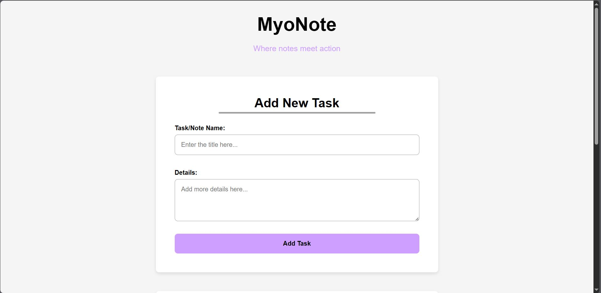
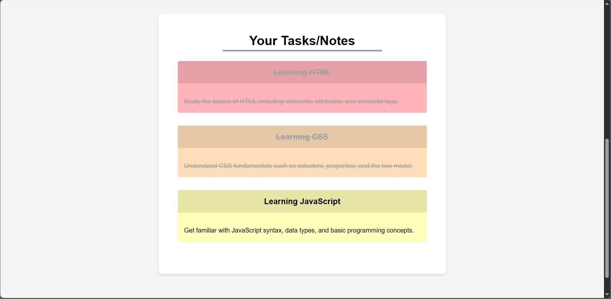

 

# "MyoNote -  To Do List Web App"   - Misael's 3rd F. End Learning Project 

Hello... 😃👋🏻  
It's me Misael (_ElMyosotisCode_) your future Front End Developer Expert.

This project is my third learning project in the field of Front End Dev. As stated in the title, this project is a simple web application that contains a To-Do List tool.

---

## 🗺️ Roadmap

So here are my plans for this learning project...  
⚠️ _May change in the future_

 

### 🎯 **_Phase 1 : The Base of Interactive Prototype_**

> Create a fully interactive application on the client side. Users can add, manage, and delete tasks. At the end of this phase, I will have a product that “looks” and “feels” complete, even though the data is not yet persistent.

 

* ☑ **`HTML`** | <u> A basic structural sketch for the To-Do List Web-App. </u>

    * _Building the core structure with semantic tags to ensure accessibility and a solid foundation_

 

* ☑ **`CSS`** | <u> A clean, centered layout for the main Web-App. </u>

    * _Applying the "Centered Container" pattern using `max-width` and `margin: auto` for cleaner visuals._

* ☑ **`CSS`** | <u> Modern styling for all interactive elements. </u>

    * _Giving styles for inputs, buttons, and task items so it will be visually clear and consistent._

* ☑ **`CSS`** | <u> Visual feedback for user actions and task states. </u>
    
    *  _Creating a `.completed` state class that acts as a bridge between `CSS` and `JavaScript` to reflect task status._

 

* ☑ **`JS`** | <u> Using a structured data list as the Web-App's brain. </u>

    * _Defining an `Array of Objects` as the single source of truth for all task data._

* ☑ **`JS`** | <u> Displaying the task list on the screen automatically. </u>

    * _Implementing a `render()` function that dynamically generates `HTML` from the data array and injects it into the `DOM` ._

* ⬜ **`JS`** | <u> Making the "Add Task" button actually work. </u>

    * _Capturing user input via a `submit` event listener and updating the data array with the new task._

* ⬜ **`JS`** | <u> Allowing users to mark tasks as completed. </u>

    * _Using event delegation and the `.map()` method to toggle the `completed` status of a task in the data array._

* ⬜ **`JS`** | <u> Allowing users to remove tasks from their list. </u>

    * _Using event delegation and the `.filter()` method to remove a task from the data array._

 

- - - - -

 

### 🎯 **_Phase 2 : Web-App Memory_**

 

- - - - -

 

### 🎯 **_Phase 3 : Web-App Polishing_**

---

## 🛠️ Development Log / Project Journal

### Project Progress Session 01 - Project Setup & JavaScript First Contact
📅 _**Date:** 2025-08-26_

 

💬 In this initial session of MyoNote project, the primary focus was on establishing a professional project workflow and building the foundational structure. Today, I laid the complete groundwork for the application and made the first successful connection into the JavaScript.

 

*  📍 **Semantic `HTML` Structure**
    
    * Created the core index.html file, complete with a semantic layout ( `<header>`, `<main>` ), a `<form>` for task input, and an empty `<ul>` to serve as the task list container.

 

* 📍 **`CSS` Base Architecture and Variables Implementation**

    * Added a personal customized `CSS` architecture inside `styling.css` file, did `CSS` minimal resets, and added a set of basic variables that will be used for styling purposes later on.

 

* 📍 **`JavaScript` Integration & Verification**

    * Successfully linked the `script.js` file to the HTML and confirmed the connection via the browser's developer console, marking the app's first "pulse" of interactivity.

 

### Web-App Visual in Progress Session 01 📸

- - - - -

---

### Project Progress Session 02 - Bringing Data to Life
📅 _**Date:** 2025-08-31_

 

💭 Today, **MyoNote** made a huge leap from just a design sketch into a living, breathing application. The main goal was to teach the app how to read a list of tasks from its "brain" (my `JavaScript` code) and display them beautifully on the screen. Now, what you see is a direct reflection of the data inside, eventhough the data is still dummy.

 

* 📌 **New Feature: Your Task List is Now Visible!**
    
    * The app can now process a predefined list of tasks and automatically build the task list you see on the page. Each task is created as its own item, complete with a title and detailed notes.

 

* 📌 **New Feature: "Completed" Tasks Now Look Different!**

    * We've built a "bridge" between our data and the visual design. Now, if a task is marked as 'completed' in the data, it will automatically appear crossed-out on the screen, giving you clear visual feedback on your progress.

 

* 📌 **UI/UX Upgrade: From Plain List to Colorful Cards!**

    * The boring, default list has been transformed into a much more organized and visually appealing card-based design. Each task now sits in its own "card".

    * To make things more lively, each card now has a soft, colorful background, with colors alternating automatically to make the list easier to scan and more pleasant to look at.

    * The "Add New Task" form has also been cleaned up, with labels and input fields now neatly organized for a better user experience.

 

### Web-App Visual in Progress Session 02 📸

 

- - - - -

---

## 💡 Points of Key Learnings

### Learning Module Session 01 ~ JavaScript Fundamentals & DOM Connection

 

📚 Here are some key points I learned through this session:

* 🔸 **`JavaScript`'s Role & Proper Integration**

    * Understood that while `HTML` provides the base structure and `CSS` provides the skin and visuals, meanwhile `JavaScript` provides the "brain and muscles" that bring a webpage to life with interactivity.

    * Learned the best practice of placing the `<script>` tag just before the closing `</body>` tag. This ensures the user sees the page content ( `HTML` ) first, leading to a faster perceived load time, before the browser pauses to parse and execute the JS file.

 

* 🔸 **`JavaScript` Variables: The Core of Data Storage ( `let` vs `const` )**

    * Mastered the fundamental difference between the two primary variable declarations:

        * 🟣 `let` : <u>Creates a mutable binding</u>, like a value written on a whiteboard that can be erased and rewritten. It should only be used when a variable's value is expected to change in the future.

        * 🟣 `const` : <u>Creates an immutable binding to a value</u>. This is the modern standard and should be the default choice to prevent accidental reassignments and create more predictable code.

    * Explored the critical distinction between **Primitive** vs **Reference** Types in terms of `const` . For primitives ( `string` , `number` ), the value itself is constant. For references ( `object` , `array` ), the reference (the "_key to the house_") is constant, but the contents inside the reference (the "_furniture in the house_") can still be modified.

 

* 🔸 **Data Primitives & Essential Debugging Tools**

    * Identified the five primitive data types in `JavaScript` : `string` , `number` , `boolean` , `undefined` (a variable that has been declared but not yet assigned a value), and `null` (a value explicitly set to "_empty_" by the developer).

    * Utilized the `typeof` operator as a powerful "_scanner_" to inspect the data type of any variable, which is a useful tool for debugging.

    * Reinforced the use of `console.log()` as the primary method for inspecting variable values, checking code flow, and verifying that the application is behaving as expected. It's the developer's most essential debugging instrument.

  

- - - - -

  

### Learning Module Session 02 ~ Data Rendering, DOM Manipulation, & Dynamic Styling

 

💡 Here are some key points I learned through this session:

*   🔹 **The "Data -> Render -> View" Pattern & Single Source of Truth**

    *   Mastered the fundamental front-end development pattern where the application's state is held in a centralized data structure (the **Single Source of Truth**). The UI is then generated (or "rendered") as a direct reflection of this data.

    *   Utilized an **Array of Objects** (`const todos = [...]`) as the data structure. This is a superior approach to simple arrays as it allows each "to-do" item to be a self-contained entity with multiple related properties (`id`, `title`, `details`, `completed`).

 

*   🔹 **Dynamic HTML Generation & DOM Injection**

    *   Leveraged the **`.forEach()`** array method to iterate over the data source. This declarative approach is cleaner and more readable than a traditional `for` loop for this use case.

    *   Utilized **Template Literals ( ` `` ` )** to construct multi-line HTML strings with ease. Mastered the `${...}` syntax to dynamically embed JavaScript expressions and variable values directly into these strings.

    *   Practiced the concept of string **accumulation** using the `+=` operator to build a single, comprehensive HTML string from multiple pieces inside the loop.

    *   Successfully manipulated the DOM by assigning the generated HTML string to the **`.innerHTML`** property of a targeted DOM element (`<ul>`). This is the final step that makes the data visible to the user.

 

*   🔹 **Conditional Rendering & Dynamic Styling with CSS**

    *   Implemented the **Ternary Operator (`condition ? exprIfTrue : exprIfFalse`)** as a concise, inline `if/else` expression. Its power lies in its ability to *return a value*, making it perfect for use inside Template Literals.

    *   Created a "bridge" between the data layer and the presentation layer by using the ternary operator to conditionally add a **BEM modifier class** (`.todo-completed`) to an element based on a boolean property (`todo.completed`) in the data.

    *   Explored the power of the **`:nth-child()`** pseudo-class in CSS to apply styling based on an element's position within its parent. This allows for complex, repeating patterns (like alternating background colors) without cluttering the JavaScript or HTML with additional state classes.

 

*   🔹 **Advanced CSS & Semantic HTML Structure**

    *   Understood that an `<li>` element is a flexible container ("Flow Content") and can semantically house other block-level elements like `<h4>` and `
` to create richer, more structured list items, following the "Card" design pattern.
    
    *   Practiced creating subtle, dynamic background overlays using `rgba()` with a low alpha value, and learned the professional technique of separating RGB values into their own CSS variables for maximum flexibility and maintainability.

- - - - -

---

**_Updated on : 2025, Aug. 31st_**

